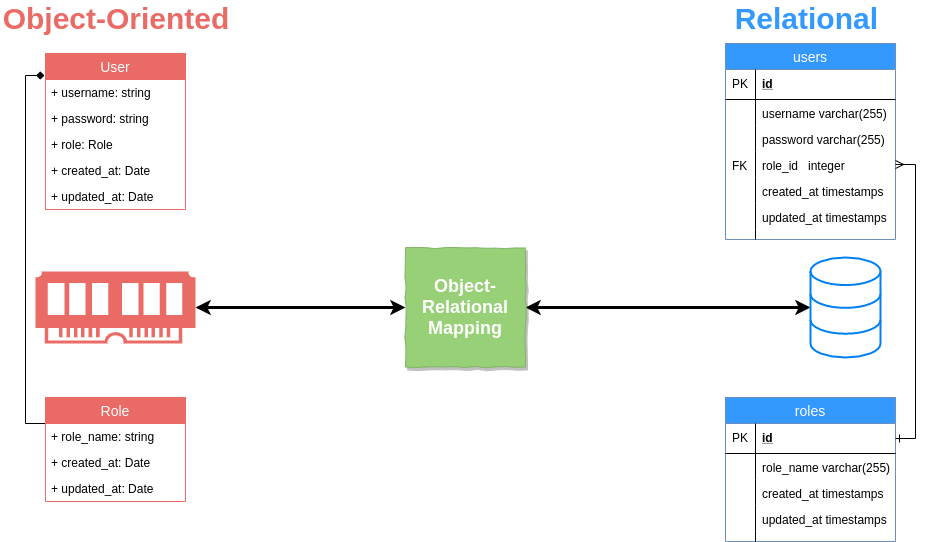
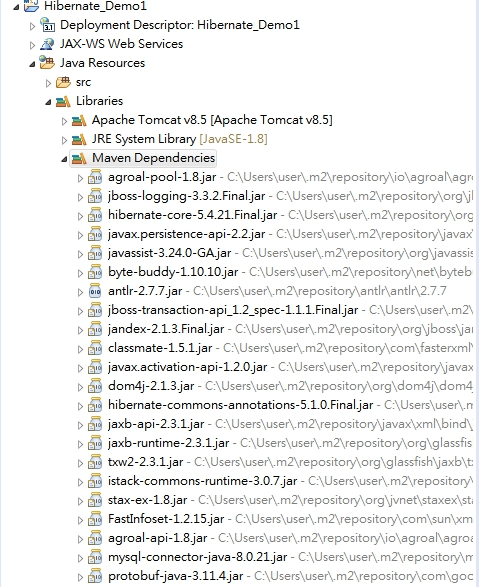

# Hibernate 入門教學
## 一、Hibernate Framework 簡介
### 1. Hibernate 是一個基於jdbc的開源的持久化框架，是一個優秀的ORM實現，它很大程度的簡化了dao層編碼工作。
### 2. Hibernate對JDBC訪問資料庫的程式碼做了封裝，大大簡化了資料訪問層繁瑣的重複性程式碼。
### 3. Hibernate 在分層結構中處於持久化層，封裝對資料庫的訪問細節，使業務邏輯層更專注於實現業務邏輯。
### 4. Hibernate 的設計目標是將軟體開發人員從大量相同的資料持久層相關編程工作中解放出來。無論是從設計草案還是從一個遺留資料庫開始，開發人員都可以採用Hibernate。
### 5. Hibernate不僅負責從Java類到資料庫表的對映（還包括從Java資料類型到SQL資料類型的對映），還提供了物件導向的資料查詢檢索機制，從而極大地縮短了手動處理SQL和JDBC上的開發時間。
### 發展歷程:
#### 2001年，澳大利亞墨爾本一位名為Gavin King的27歲的程式設計師，上街買了一本SQL編程的書，他厭倦了實體bean，認為自己可以開發出一個符合物件關係對映理論，並且真正好用的Java持久化層框架，因此他需要先學習一下SQL。這一年的11月，Hibernate的第一個版本發布了。
#### 2002年，已經有人開始關注和使用Hibernate了。
#### 2003年9月，Hibernate開發團隊進入JBoss公司，開始全職開發Hibernate，從這個時候開始Hibernate得到了突飛猛進的普及和發展。
#### 2004年，整個Java社群開始從實體bean向Hibernate轉移，特別是在Rod Johnson的著作《Expert One-on-One J2EE Development without EJB》出版後，由於這本書以紮實的理論、充分的論據和詳實的論述否定了EJB，提出了輕量級敏捷開發理念之後，以Hibernate和Spring為代表的輕量級開源框架開始成為Java世界的主流和事實標準。在2004年Sun領導的J2EE5.0標準制定當中的持久化框架標準正式以Hibernate為藍本。
#### 2006年，J2EE5.0標準正式發布以後，持久化框架標準Java Persistent API（簡稱JPA）基本上是參考Hibernate實現的，而Hibernate在3.2版本開始，已經完全相容JPA標準。
#### Hibernate 的主頁：[http://www.hibernate.org/](http://www.hibernate.org/)。
#### Hibernate 的下載地址：[http://hibernate.org/orm/downloads/](http://hibernate.org/orm/downloads/)。
#### 在 Eclipse 中如何安裝 Hibernate Tools 外掛:請參看[Eclipse線上配置Hibernate Tools](https://www.itread01.com/content/1547853862.html)。
### JPA和Hibernate間的關係:-- [參考資料](https://www.itread01.com/content/1547175259.html)
#### JPA和Hibernate之間的關係，可以簡單的理解為JPA是標準介面，Hibernate是實現，Hibernate屬於遵循JPA規範的一種實現，但是JPA是Hibernate遵循的規範之一，Hibernate還有其他實現的規範。
***
## 二、ORM 是什麼? ORM 介紹
### ORM是甚麼呢？ORM全名是Object-Relational Mapping，中文是物件關係對映。顧名思義，就是將關聯式資料庫(Relational Database Management System)的資料，映射到物件(Object)之中，反之亦然。
### 關聯式資料庫(Relational Database)與物件導向的編程，先天就有不少不契合的地方，電腦科學有一個專有名詞去形容關聯式資料庫與物件導向設計之間之不協調，也就是Object-relational impedance mismatch。為數不少的物件導向概念例如接口、繼承等，在資料庫的世界，完全沒有相對應的概念。 ORM的存在意義，就是為了撫平兩者中間的不協調，將資料庫中的資料，映射到記憶體的物件之中，而無需軟件工程師再煩惱。
### 
### ORM的優缺點：
### 優點：
#### 1）提高開發效率，降低開發成本
#### 2）使開發更加物件化
#### 3）可移植
#### 4）可以很方便地引入資料快取之類的附加功能
### 缺點：
#### 1）自動化進行關係資料庫的對映需要消耗系統性能。其實這裡的效能消耗還好啦，一般來說都可以忽略之。
#### 2）在處理多表聯查、where條件複雜之類的查詢時，ORM的語法會變得複雜。
### 常用ORM框架：
#### （1）Hibernate : 全自動,需要寫hql語句
#### （2）iBATIS : 半自動,自己寫sql語句,可操作性強,小巧
***
## 三、Hibernate 架構
### Hibernate架構是分層的，隔離的不必知道底層API。 Hibernate中使用數據庫和配置信息來為應用程序提供持久化服務（以及持久的類）。
### 
### 
### Hibernate使用各種現有的Java API，如JDBC，Java事務API（JTA）和Java命名和目錄接口（JNDI）。
### JDBC提供了常見的關係數據庫功能的抽象的一個基本功能，使其具有JDBC驅動程序，Hibernate支持幾乎任何數據庫。
### Hibernate的核心元件簡介：
### 1. Configuration 類
#### 是在任何Hibernate應用程序中創建並通常在應用程序初始化創建一次，第一個Hibernate的類。它代表了Hibernate所需的配置或屬性文件。 
#### Configuration 類提供了兩個按鍵組成部分：
#### 1) 數據庫連接：這是通過Hibernate支持的一個或多個配置文件來處理。這些文件是：
#### hibernate.properties和hibernate.cfg.xml。
#### 2) 類映射設置：此類創建Java類和數據庫表之間的連接。
### 2. SessionFactory介面:
#### SessionFactroy介面負責初始化Hibernate。它充當資料儲存源的代理,並負責建立Session物件。這裡用到了工廠模式。
#### 一個SessionFactory對應一個數據源，它是個重量級物件，不可隨意生成多個例項。對於一般的單資料庫應用來說，只需要一個SessionFactory就足夠了。
#### 當然如果有多個數據庫的話，還是需要為每個資料庫生成對應的SessionFactory。它是執行緒安全的，同一個例項可以被應用中的多個執行緒共享。
### 3. Session介面:
#### Session介面負責執行被持久化物件的操作,它有get( ),load( ),save( ),update( )和delete( )等方法用來對 PO 進行載入、儲存、更新及刪除等操作。
#### 但需要注意的是Session物件是非執行緒安全的。同時,Hibernate的session不同於JSP應用中的HttpSession。這裡當使用session這個術語時,其實指的是Hibernate中的session。
#### 非執行緒安全是指多執行緒操作同一個物件可能會出現問題。 而執行緒安全則是多執行緒操作同一個物件不會有問題。 執行緒安全必須要使用很多synchronized關鍵字來同步控制，所以必然會導致效能的降低。 
### 4. Transaction介面:
#### Transaction介面負責事務相關的操作,用來管理Hibernate事務,它的主要方法有commit()和rollback(),可以使用Session的beginTransaction()方法生成。它是可選的,開發人員也可以設計編寫自己的底層事務處理程式碼。
### 5. Query介面:
#### Query介面負責執行各種資料庫查詢。它可以使用HQL語言,用來對PO進行查詢操作。它可以使用Session的createQuery()方法生成。
### 6. Criteria介面： 
#### 完全封裝了基於字串形式的查詢語句，比Query更面向物件，Criteria更擅長執行動態查詢。
*** 
## 四、Hibernate 環境配置
### 本章將解釋如何安裝Hibernate和其他相關的包準備開發環境為Hibernate應用程序。我們將使用MySQL數據庫的工作，嘗試使用Hibernate的範例。
### 1. 開啟 Eclipse -> Dynamic Web Project -> Convert to Maven Project 
### 2. 設定對應工具庫配置 pom.xml:
	<project xmlns="http://maven.apache.org/POM/4.0.0" xmlns:xsi="http://www.w3.org/2001/XMLSchema-instance" xsi:schemaLocation="http://maven.apache.org/POM/4.0.0 https://maven.apache.org/xsd/maven-4.0.0.xsd">
	  <modelVersion>4.0.0</modelVersion>
	  <groupId>Hibernate_Maven_Demo</groupId>
	  <artifactId>Hibernate_Maaven_Demo</artifactId>
	  <version>0.0.1-SNAPSHOT</version>
	  <packaging>war</packaging>
	  <dependencies>
			<dependency>
			  <groupId>org.hibernate</groupId>
			  <artifactId>hibernate-agroal</artifactId>
			  <version>5.4.21.Final</version>
			  <type>pom</type>
			</dependency>
			<dependency>
				<groupId>mysql</groupId>
				<artifactId>mysql-connector-java</artifactId>
				<version>8.0.21</version>
			</dependency>
	  </dependencies>
	  <build>
		<sourceDirectory>src</sourceDirectory>
		<plugins>
		  <plugin>
			<artifactId>maven-compiler-plugin</artifactId>
			<version>3.8.0</version>
			<configuration>
			  <source>1.8</source>
			  <target>1.8</target>
			</configuration>
		  </plugin>
		  <plugin>
			<artifactId>maven-war-plugin</artifactId>
			<version>3.2.3</version>
			<configuration>
			  <warSourceDirectory>WebContent</warSourceDirectory>
			</configuration>
		  </plugin>
		</plugins>
	  </build>
	</project>
### 這樣 Maven 套件會自動將對應之工具庫載入 CLASSPATH , 如下圖:
###  

## 五、Hibernate 配置
### 我們要在類路徑下(即src目錄下)建立Hibernate配置檔案——hibernate.cfg.xml,hibernate.properties。
### Hibernate可以使用XML檔案或properties檔案來配置SessionFactory，預設的配置文件名稱為 hibernate.cfg.xml或hibernate.properties，使用下面的方式來讀入文件以配置Hibernate：
###	Configuration config = new Configuration().configure();
### 當使用new建構Configuration物件時，會讀取Classpath路徑下的 hibernate.properties，
### 如果呼叫Configuration的configure()方法沒有指定路徑與檔案名稱時，則會再讀取 Classpath路徑下的hibernate.cfg.xml，
### 如果有與hibernate.properties相同的屬性設定，則 hibernate.cfg.xml中的設定會覆蓋hibernate.properties中的設定。
### hibernate.cfg.xml 範例：
	<?xml version="1.0" encoding="utf-8"?> 
	<!DOCTYPE hibernate-configuration PUBLIC
		"-//Hibernate/Hibernate Configuration DTD 3.0//EN"
		"http://hibernate.sourceforge.net/hibernate-configuration-3.0.dtd">
		
	<hibernate-configuration> 

		<session-factory> 
			<!-- 自動建表  -->
			<property name="hbm2ddl.auto">create</property>  
			<!-- 顯示實際操作資料庫時的SQL --> 
			<property name="show_sql">true</property> 
			<!-- 將顯示的SQL排版，方便觀看 -->
			<property name="format_sql">true</property>
			<!-- SQL方言，這邊設定的是MySQL --> 
			<property name="dialect">org.hibernate.dialect.MySQL8Dialect</property> 
			<!-- JDBC驅動程式 --> 
			<property name="connection.driver_class">com.mysql.jdbc.Driver</property> 
			 <!-- JDBC URL --> 
			<property name="connection.url">jdbc:mysql://localhost:3306/demo?createDatabaseIfNotExist=true&allowPublicKeyRetrieval=true&useSSL=false&serverTimezone=Asia/Taipei</property> 
			<!-- 資料庫使用者 --> 
			<property name="connection.username">root</property> 
			<!-- 資料庫密碼 --> 
			<property name="connection.password">1234</property> 

			<!-- 物件與資料庫表格映射文件 --> 
			<mapping resource="demo/hbm/User.hbm.xml"/> 

		</session-factory> 

	</hibernate-configuration>
