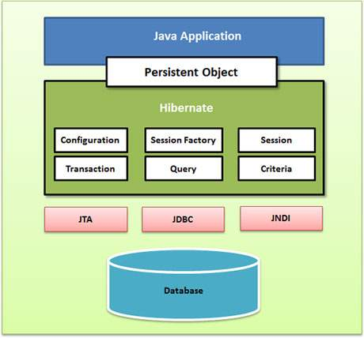

# Hibernate 入門教學
## 一、Hibernate Framework 簡介
### 1. Hibernate 是一個基於jdbc的開源的持久化框架，是一個優秀的ORM實現，它很大程度的簡化了dao層編碼工作。
### 2. Hibernate對JDBC訪問資料庫的程式碼做了封裝，大大簡化了資料訪問層繁瑣的重複性程式碼。
### 3. Hibernate 在分層結構中處於持久化層，封裝對資料庫的訪問細節，使業務邏輯層更專注於實現業務邏輯。
### 4. Hibernate 的設計目標是將軟體開發人員從大量相同的資料持久層相關編程工作中解放出來。無論是從設計草案還是從一個遺留資料庫開始，開發人員都可以採用Hibernate。
### 5. Hibernate不僅負責從Java類到資料庫表的對映（還包括從Java資料類型到SQL資料類型的對映），還提供了物件導向的資料查詢檢索機制，從而極大地縮短了手動處理SQL和JDBC上的開發時間。
### 發展歷程:
#### 2001年，澳大利亞墨爾本一位名為Gavin King的27歲的程式設計師，上街買了一本SQL編程的書，他厭倦了實體bean，認為自己可以開發出一個符合物件關係對映理論，並且真正好用的Java持久化層框架，因此他需要先學習一下SQL。這一年的11月，Hibernate的第一個版本發布了。
#### 2002年，已經有人開始關注和使用Hibernate了。
#### 2003年9月，Hibernate開發團隊進入JBoss公司，開始全職開發Hibernate，從這個時候開始Hibernate得到了突飛猛進的普及和發展。
#### 2004年，整個Java社群開始從實體bean向Hibernate轉移，特別是在Rod Johnson的著作《Expert One-on-One J2EE Development without EJB》出版後，由於這本書以紮實的理論、充分的論據和詳實的論述否定了EJB，提出了輕量級敏捷開發理念之後，以Hibernate和Spring為代表的輕量級開源框架開始成為Java世界的主流和事實標準。在2004年Sun領導的J2EE5.0標準制定當中的持久化框架標準正式以Hibernate為藍本。
#### 2006年，J2EE5.0標準正式發布以後，持久化框架標準Java Persistent API（簡稱JPA）基本上是參考Hibernate實現的，而Hibernate在3.2版本開始，已經完全相容JPA標準。
#### Hibernate 的主頁：[http://www.hibernate.org/](http://www.hibernate.org/)。
#### Hibernate 的下載地址：[http://hibernate.org/orm/downloads/](http://hibernate.org/orm/downloads/)。
#### 在 Eclipse 中如何安裝 Hibernate Tools 外掛:請參看[Eclipse線上配置Hibernate Tools](https://www.itread01.com/content/1547853862.html)。
### JPA和Hibernate間的關係:-- [參考資料](https://www.itread01.com/content/1547175259.html)
#### JPA和Hibernate之間的關係，可以簡單的理解為JPA是標準介面，Hibernate是實現，Hibernate屬於遵循JPA規範的一種實現，但是JPA是Hibernate遵循的規範之一，Hibernate還有其他實現的規範。
***
## 二、ORM 是什麼? ORM 介紹
### ORM是甚麼呢？ORM全名是Object-Relational Mapping，中文是物件關係對映。顧名思義，就是將關聯式資料庫(Relational Database Management System)的資料，映射到物件(Object)之中，反之亦然。
### 關聯式資料庫(Relational Database)與物件導向的編程，先天就有不少不契合的地方，電腦科學有一個專有名詞去形容關聯式資料庫與物件導向設計之間之不協調，也就是Object-relational impedance mismatch。為數不少的物件導向概念例如接口、繼承等，在資料庫的世界，完全沒有相對應的概念。 ORM的存在意義，就是為了撫平兩者中間的不協調，將資料庫中的資料，映射到記憶體的物件之中，而無需軟件工程師再煩惱。
### 
### ORM的優缺點：
### 優點：
#### 1）提高開發效率，降低開發成本
#### 2）使開發更加物件化
#### 3）可移植
#### 4）可以很方便地引入資料快取之類的附加功能
### 缺點：
#### 1）自動化進行關係資料庫的對映需要消耗系統性能。其實這裡的效能消耗還好啦，一般來說都可以忽略之。
#### 2）在處理多表聯查、where條件複雜之類的查詢時，ORM的語法會變得複雜。
### 常用ORM框架：
#### （1）Hibernate : 全自動,需要寫hql語句
#### （2）iBATIS : 半自動,自己寫sql語句,可操作性強,小巧
***
## 三、Hibernate 架構
### 
### 
