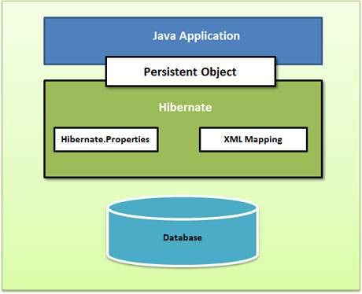
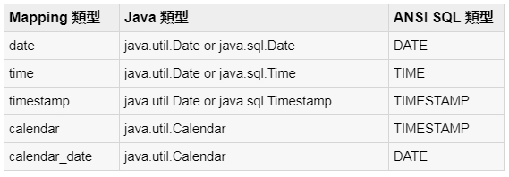
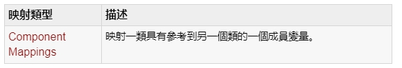

# Hibernate 入門教學
## 一、Hibernate Framework 簡介
### 1. Hibernate 是一個基於jdbc的開源的持久化框架，是一個優秀的ORM實現，它很大程度的簡化了dao層編碼工作。
### 2. Hibernate對JDBC訪問資料庫的程式碼做了封裝，大大簡化了資料訪問層繁瑣的重複性程式碼。
### 3. Hibernate 在分層結構中處於持久化層，封裝對資料庫的訪問細節，使業務邏輯層更專注於實現業務邏輯。
### 4. Hibernate 的設計目標是將軟體開發人員從大量相同的資料持久層相關編程工作中解放出來。無論是從設計草案還是從一個遺留資料庫開始，開發人員都可以採用Hibernate。
### 5. Hibernate不僅負責從Java類到資料庫表的對映（還包括從Java資料類型到SQL資料類型的對映），還提供了物件導向的資料查詢檢索機制，從而極大地縮短了手動處理SQL和JDBC上的開發時間。
### 發展歷程:
#### 2001年，澳大利亞墨爾本一位名為Gavin King的27歲的程式設計師，上街買了一本SQL編程的書，他厭倦了實體bean，認為自己可以開發出一個符合物件關係對映理論，並且真正好用的Java持久化層框架，因此他需要先學習一下SQL。這一年的11月，Hibernate的第一個版本發布了。
#### 2002年，已經有人開始關注和使用Hibernate了。
#### 2003年9月，Hibernate開發團隊進入JBoss公司，開始全職開發Hibernate，從這個時候開始Hibernate得到了突飛猛進的普及和發展。
#### 2004年，整個Java社群開始從實體bean向Hibernate轉移，特別是在Rod Johnson的著作《Expert One-on-One J2EE Development without EJB》出版後，由於這本書以紮實的理論、充分的論據和詳實的論述否定了EJB，提出了輕量級敏捷開發理念之後，以Hibernate和Spring為代表的輕量級開源框架開始成為Java世界的主流和事實標準。在2004年Sun領導的J2EE5.0標準制定當中的持久化框架標準正式以Hibernate為藍本。
#### 2006年，J2EE5.0標準正式發布以後，持久化框架標準Java Persistent API（簡稱JPA）基本上是參考Hibernate實現的，而Hibernate在3.2版本開始，已經完全相容JPA標準。
#### Hibernate 的主頁：[http://www.hibernate.org/](http://www.hibernate.org/)。
#### Hibernate 的下載地址：[http://hibernate.org/orm/downloads/](http://hibernate.org/orm/downloads/)。
#### 在 Eclipse 中如何安裝 Hibernate Tools 外掛:請參看[Eclipse線上配置Hibernate Tools](https://www.itread01.com/content/1547853862.html)。
### JPA和Hibernate間的關係:-- [參考資料](https://www.itread01.com/content/1547175259.html)
#### JPA和Hibernate之間的關係，可以簡單的理解為JPA是標準介面，Hibernate是實現，Hibernate屬於遵循JPA規範的一種實現，但是JPA是Hibernate遵循的規範之一，Hibernate還有其他實現的規範。
***
## 二、ORM 是什麼? ORM 介紹
### ORM是甚麼呢？ORM全名是Object-Relational Mapping，中文是物件關係對映。顧名思義，就是將關聯式資料庫(Relational Database Management System)的資料，映射到物件(Object)之中，反之亦然。
### 關聯式資料庫(Relational Database)與物件導向的編程，先天就有不少不契合的地方，電腦科學有一個專有名詞去形容關聯式資料庫與物件導向設計之間之不協調，也就是Object-relational impedance mismatch。為數不少的物件導向概念例如接口、繼承等，在資料庫的世界，完全沒有相對應的概念。 ORM的存在意義，就是為了撫平兩者中間的不協調，將資料庫中的資料，映射到記憶體的物件之中，而無需軟件工程師再煩惱。
### 
### ORM的優缺點：
### 優點：
#### 1）提高開發效率，降低開發成本
#### 2）使開發更加物件化
#### 3）可移植
#### 4）可以很方便地引入資料快取之類的附加功能
### 缺點：
#### 1）自動化進行關係資料庫的對映需要消耗系統性能。其實這裡的效能消耗還好啦，一般來說都可以忽略之。
#### 2）在處理多表聯查、where條件複雜之類的查詢時，ORM的語法會變得複雜。
### 常用ORM框架：
#### （1）Hibernate : 全自動,需要寫hql語句
#### （2）iBATIS : 半自動,自己寫sql語句,可操作性強,小巧
***
## 三、Hibernate 架構
### Hibernate架構是分層的，隔離的不必知道底層API。 Hibernate中使用數據庫和配置信息來為應用程序提供持久化服務（以及持久的類）。
### 
### 
### Hibernate使用各種現有的Java API，如JDBC，Java事務API（JTA）和Java命名和目錄接口（JNDI）。
### JDBC提供了常見的關係數據庫功能的抽象的一個基本功能，使其具有JDBC驅動程序，Hibernate支持幾乎任何數據庫。
### Hibernate的核心元件簡介：
### 1. Configuration 類
#### 是在任何Hibernate應用程序中創建並通常在應用程序初始化創建一次，第一個Hibernate的類。它代表了Hibernate所需的配置或屬性文件。 
#### Configuration 類提供了兩個按鍵組成部分：
#### 1) 數據庫連接：這是通過Hibernate支持的一個或多個配置文件來處理。這些文件是：
#### hibernate.properties和hibernate.cfg.xml。
#### 2) 類映射設置：此類創建Java類和數據庫表之間的連接。
### 2. SessionFactory介面:
#### SessionFactroy介面負責初始化Hibernate。它充當資料儲存源的代理,並負責建立Session物件。這裡用到了工廠模式。
#### 一個SessionFactory對應一個數據源，它是個重量級物件，不可隨意生成多個例項。對於一般的單資料庫應用來說，只需要一個SessionFactory就足夠了。
#### 當然如果有多個數據庫的話，還是需要為每個資料庫生成對應的SessionFactory。它是執行緒安全的，同一個例項可以被應用中的多個執行緒共享。
### 3. Session介面:
#### Session介面負責執行被持久化物件的操作,它有get( ),load( ),save( ),update( )和delete( )等方法用來對 PO 進行載入、儲存、更新及刪除等操作。
#### 但需要注意的是Session物件是非執行緒安全的。同時,Hibernate的session不同於JSP應用中的HttpSession。這裡當使用session這個術語時,其實指的是Hibernate中的session。
#### 非執行緒安全是指多執行緒操作同一個物件可能會出現問題。 而執行緒安全則是多執行緒操作同一個物件不會有問題。 執行緒安全必須要使用很多synchronized關鍵字來同步控制，所以必然會導致效能的降低。 
### 4. Transaction介面:
#### Transaction介面負責事務相關的操作,用來管理Hibernate事務,它的主要方法有commit()和rollback(),可以使用Session的beginTransaction()方法生成。它是可選的,開發人員也可以設計編寫自己的底層事務處理程式碼。
### 5. Query介面:
#### Query介面負責執行各種資料庫查詢。它可以使用HQL語言,用來對PO進行查詢操作。它可以使用Session的createQuery()方法生成。
### 6. Criteria介面： 
#### 完全封裝了基於字串形式的查詢語句，比Query更面向物件，Criteria更擅長執行動態查詢。
*** 
## 四、Hibernate 環境配置
### 本章將解釋如何安裝Hibernate和其他相關的包準備開發環境為Hibernate應用程序。我們將使用MySQL數據庫的工作，嘗試使用Hibernate的範例。
### 1. 開啟 Eclipse -> Dynamic Web Project -> Convert to Maven Project 
### 2. 設定對應工具庫配置 pom.xml:
	<project xmlns="http://maven.apache.org/POM/4.0.0" xmlns:xsi="http://www.w3.org/2001/XMLSchema-instance" xsi:schemaLocation="http://maven.apache.org/POM/4.0.0 https://maven.apache.org/xsd/maven-4.0.0.xsd">
	  <modelVersion>4.0.0</modelVersion>
	  <groupId>Hibernate_Maven_Demo</groupId>
	  <artifactId>Hibernate_Maaven_Demo</artifactId>
	  <version>0.0.1-SNAPSHOT</version>
	  <packaging>war</packaging>
	  <dependencies>
			<dependency>
			  <groupId>org.hibernate</groupId>
			  <artifactId>hibernate-agroal</artifactId>
			  <version>5.4.21.Final</version>
			  <type>pom</type>
			</dependency>
			<dependency>
				<groupId>mysql</groupId>
				<artifactId>mysql-connector-java</artifactId>
				<version>8.0.21</version>
			</dependency>
	  </dependencies>
	  <build>
		<sourceDirectory>src</sourceDirectory>
		<plugins>
		  <plugin>
			<artifactId>maven-compiler-plugin</artifactId>
			<version>3.8.0</version>
			<configuration>
			  <source>1.8</source>
			  <target>1.8</target>
			</configuration>
		  </plugin>
		  <plugin>
			<artifactId>maven-war-plugin</artifactId>
			<version>3.2.3</version>
			<configuration>
			  <warSourceDirectory>WebContent</warSourceDirectory>
			</configuration>
		  </plugin>
		</plugins>
	  </build>
	</project>
### 這樣 Maven 套件會自動將對應之工具庫載入 CLASSPATH , 如下圖:
###  
***
## 五、Hibernate 配置
### 我們要在類路徑下(即src目錄下)建立Hibernate配置檔案——hibernate.cfg.xml,hibernate.properties。
### Hibernate可以使用XML檔案或properties檔案來配置SessionFactory，預設的配置文件名稱為 hibernate.cfg.xml或hibernate.properties，使用下面的方式來讀入文件以配置Hibernate：
###	Configuration config = new Configuration().configure();
### 當使用new建構Configuration物件時，會讀取Classpath路徑下的 hibernate.properties，
### 如果呼叫Configuration的configure()方法沒有指定路徑與檔案名稱時，則會再讀取 Classpath路徑下的hibernate.cfg.xml，
### 如果有與hibernate.properties相同的屬性設定，則 hibernate.cfg.xml中的設定會覆蓋hibernate.properties中的設定。
### hibernate.cfg.xml 範例：
	<?xml version="1.0" encoding="utf-8"?> 
	<!DOCTYPE hibernate-configuration PUBLIC
		"-//Hibernate/Hibernate Configuration DTD 3.0//EN"
		"http://hibernate.sourceforge.net/hibernate-configuration-3.0.dtd">
		
	<hibernate-configuration> 

		<session-factory> 
			<!-- 自動建表  -->
			<property name="hbm2ddl.auto">create</property>  
			<!-- 顯示實際操作資料庫時的SQL --> 
			<property name="show_sql">true</property> 
			<!-- 將顯示的SQL排版，方便觀看 -->
			<property name="format_sql">true</property>
			<!-- SQL方言，這邊設定的是MySQL --> 
			<property name="dialect">org.hibernate.dialect.MySQL8Dialect</property> 
			<!-- JDBC驅動程式 --> 
			<property name="connection.driver_class">com.mysql.jdbc.Driver</property> 
			 <!-- JDBC URL --> 
			<property name="connection.url">jdbc:mysql://localhost:3306/demo?createDatabaseIfNotExist=true&allowPublicKeyRetrieval=true&useSSL=false&serverTimezone=Asia/Taipei</property> 
			<!-- 資料庫使用者 --> 
			<property name="connection.username">root</property> 
			<!-- 資料庫密碼 --> 
			<property name="connection.password">1234</property> 

			<!-- 物件與資料庫表格映射文件 --> 
			<mapping resource="demo/hbm/User.hbm.xml"/> 

		</session-factory> 

	</hibernate-configuration>
***
## 六、Hibenate Sessions
### Hibernate在對資料庫進行操作之前，必須先取得Session實例，相當於JDBC在對資料庫操作之前，必須先取得Connection實例， 
### Session是Hibernate操作的基礎，它不是設計為執行緒安全（Thread-safe），一個Session由一個執行緒來使用。
### 1. 開啟Session:
#### Session實例由SessionFactory開啟獲得，例如：
	Configuration config = new Configuration().configure();
	SessionFactory sessionFactory = config.buildSessionFactory();
	Session session = sessionFactory.openSession();
	Transaction tx = session.beginTransaction();
	....
	tx.commit();
	session.close();
#### 開啟Session不會馬上取得Connection，而是在最後真正需要連接資料庫進行更新或查詢時才會取 得Connection，
#### 如果有設定Connection pool，則從Connection pool中取得Connection，而關閉Session時，如果有設定Connection pool，則是將Connection歸還給Connection pool，而不是直接關閉Connection。
#### 在Hibernate中，開啟一個Session會建立一個Persistence context，它可以進行快取管理、dirty check等，而所有的讀取、更新、插入等動作，則是在Transaction中完成。
### 2. 儲存資料:
#### 透過Session，可以對資料庫進行新增、刪除、更新，例如使用save()新增一筆資料：
	User user = new User();
	user.setName("momor");
	user.setAge(new Integer(26));

	Session session = sessionFactory.openSession();
	Transaction tx = session.beginTransaction();
	session.save(user);
	tx.commit();
	session.close();
#### save()之後，不會馬上對資料庫進行更新，而是在Transaction的commit()之後才會對資料庫進行更新，在Transaction之間 的操作要就全部成功，要就全部失敗，如果更新失敗，則在資料庫層面會撤消所有更新操作，然而記憶體中的持久物件是不會回復原有狀態的，事實上，當 Transaction失敗，這一次的Session就要馬上跟著失效，放棄所有記憶體中的物件，而不是嘗試以原物件再進行更新的動作。
### 3. 取得資料:
#### 使用get()或load()方法取得id為1的資料：
	Session session = sessionFactory.openSession();
	Transaction tx = session.beginTransaction();
	User user = (User) session.get(User.class, new Integer(1));
	tx.commit();
	session.close();
#### 如果未能發現相符合的資料，則get()方法會返回null，而load()方 法會丟出ObjectNotFoundException，在進階的應用中，load()方法可以返回代理（proxy）物件，在必要時才真正查詢資料庫取得對應資料，並可充分利用快取機制。
### 4. 刪除資料:
#### 接下來看看使用Session刪除資料，可使用delete()刪除資料：
	Session session = sessionFactory.openSession();
	Transaction tx = session.beginTransaction();
	User user = (User) session.get(User.class, new Integer(1));
	session.delete(user);
	tx.commit();
	session.close();
### 5. 更新資料:
#### 當您在同一個Session中取出資料並封裝為Persistence Object，接著更新物件狀態，而後將Transaction commit，則物件上的狀態更新將反應至資料庫中，您無需額外進行任何的更新操作。
#### 如果開啟了一個Session，從資料表中取出資料顯示到使用者介面上，之後關閉Session，當使用者在介面上操作完畢並按下儲存時，這時要重新開啟一個Session，使用update()方法將物件中的資料更新至對應的資料表中：
	Session session = sessionFactory.openSession();
	Transaction tx = session.beginTransaction();
	User user = (User) session.get(User.class, new Integer(2));
	tx.commit();
	session.close();
	....
	user.setAge(new Integer(27));
	session = sessionFactory.openSession();   
	tx= session.beginTransaction();
	session.update(user);
	tx.commit();
	session.close();	
#### Session提供了一個saveOrUpdate()方法，為資料的儲存或更新提供了一個統一的操作介面，藉由定義映射文件時，設定< id>標籤的unsaved-value來決定什麼是新的值必需，什麼是已有的值必須更新：
	<id name="id" column="id" type="java.lang.Integer" unsaved-value="null">
		<generator class="native"/>
	</id>
#### unsaved-value可以設定的值包括：
	(1)any：總是儲存
	(2)none：總是更新
	(3)null：id為null時儲存（預設）
	(4)valid：id為null或是指定值時儲存
#### 這樣設定之後，就可以使用Session的saveOrUpdate()方法來取代update()方法。
***
## 七、Hibenate 持久化類
### 什麼是持久化類呢？在Hibernate中持久化類的英文名稱是Persistent Object(簡稱PO)。
### 持久化：將內存中的一個類持久化到數據庫中的過程。
### 持久化類：一個Java類與數據庫中的表建立了關系映射，那麽這個類在hibernate中就可以稱之為持久化類。
### 對於Hibernate中的PO，有如下編寫規則：
	1. 必須提供一個無引數的public構造方法。
	2. 所有屬性要用private修飾，對外提供public的get/set方法。
	3. 在PO類必須提供一個標識屬性，讓它與資料庫中的主鍵對應，我們管這個屬性叫OID。
	4. PO類中的屬性儘量使用基本資料型別的包裝類。
	5. PO類不能使用final修飾符。
### 對於第1、2點，勿須多言，下面著重解釋一下後面3點。
### 為何PO類必須提供一個標識屬性OID，讓它與資料庫中的主鍵對應呢？
	OID指的是與資料庫中表的主鍵對應的屬性。
	Hibernate框架是通過OID來區分不同的PO物件，如果在記憶體中有兩個相同的OID物件，那麼Hibernate認為它們是同一個物件。
	大家理解起來不是很好理解，它涉及到關於Hibernate快取的概念，因為Hibernate是對資料庫直接操作，那麼我們為了優化它呢，肯定提供一些快取的策略。
	那麼在快取裡面我們怎麼知道這個物件重不重複呢？我們是通過OID來區分的。 
### 為何PO類中的屬性應儘量使用基本資料型別的包裝類？
	使用基本資料型別是沒有辦法去描述不存在的概念的，如果使用包裝型別，它就是一個物件，對於物件它的預設值是null，
	我們知道如果它為null，就代表不存在，那麼它就可以幫助我們去描述不存在的概念。
### 為何PO類不能使用final修飾符？
#### 要回答這個問題，必須要知道Hibernate中的get/load方法的區別。這也是Hibernate中常考的面試題。我先給出答案：
	雖然get/load方法它們都是根據id去查詢物件，但他倆的區別還是蠻大的：
	1. get方法直接得到一個持久化型別物件，它就是立即查詢操作，也即我要什麼就查到什麼。
	load方法它得到的是持久化類的代理型別物件（子類物件）。
	它採用了一種延遲策略來查詢資料。這時如果PO類使用final修飾符，就會報錯，因為final修飾的類不可以被繼承。
	2. get方法在查詢時，如果不存在返回null；load方法在查詢時，如果不存在，會產生異常——org.hibernate.ObjectNotFoundException。
### 一個簡單的POJO例子：
#### 基於上麵提到的一些規則，我們可以如下定義一個POJO類：
	public class Employee {
	   private int id;
	   private String firstName; 
	   private String lastName;   
	   private int salary;  

	   public Employee() {}
	   public Employee(String fname, String lname, int salary) {
		  this.firstName = fname;
		  this.lastName = lname;
		  this.salary = salary;
	   }
	   public int getId() {
		  return id;
	   }
	   public void setId( int id ) {
		  this.id = id;
	   }
	   public String getFirstName() {
		  return firstName;
	   }
	   public void setFirstName( String first_name ) {
		  this.firstName = first_name;
	   }
	   public String getLastName() {
		  return lastName;
	   }
	   public void setLastName( String last_name ) {
		  this.lastName = last_name;
	   }
	   public int getSalary() {
		  return salary;
	   }
	   public void setSalary( int salary ) {
		  this.salary = salary;
	   }
	}

***
## 八、Hibenate 映射文件
### Hibernate 中將物件與資料庫表格映射關係連接起來的是映射文件，如果使用XML來定義，通常以*.hbm.xml作為檔案名稱。
### XML映射文件可以手工撰寫，或是透過工具程式從資料庫表格自動生成。
### 來看看一個基本的映射文件如何撰寫：
#### User.hbm.xml:
	<?xml version="1.0" encoding="utf-8"?> 
	<!DOCTYPE hibernate-mapping 
	 PUBLIC "-//Hibernate/Hibernate Mapping DTD 3.0//EN" 
	 "http://hibernate.sourceforge.net/hibernate-mapping-3.0.dtd"> 

	<hibernate-mapping> 
		<!--類別名稱與表格名稱映射-->
		<class name="demo.model.User" table="user"> 
			<!--id與主鍵映射-->
			<id name="id" column="id"> 
				<generator class="native"/> 
			</id> 
			<!--類別屬性與表格欄位的映射-->
			<property name="name" column="name"/> 
			<property name="age" column="age"/> 
		</class> 
	</hibernate-mapping>
### 映射文件中主要包括三個部份：
	1. 類別名稱與表格名稱的映射、
	2. id屬性與主鍵的映射、
	3. 類別屬性與表格欄位的映射。
### 這份映射文件對應於以下的類別與表格：
#### User.java:
	public class User {
		private Integer id;
		private String name;
		private Integer age;
	 
		// 必須要有一個預設的建構方法
		// 以使得Hibernate可以使用Constructor.newInstance()建立物件
		public User() {}

		public Integer getId() {
			return id;
		}

		public void setId(Integer id) {
			this.id = id;
		}

		public String getName() {
			return name;
		}

		public void setName(String name) {
			this.name = name;
		}
	 
		public Integer getAge() {
			return age;
		}

		public void setAge(Integer age) {
			this.age = age;
		}
	}
#### Table : User

	在 tag:id或 tag:property 的設定上，name設定類別上的屬性名，而column對應至表格欄位，如果屬性名稱與欄位名稱相同，則可以省略column屬性設定。
	<id>或<property>上，可以設定type屬性，在type上可以設定Java類別的資料 型態，但由於 Java的資料型態與資料庫的資料型態並不是一對一對應的，
	為此Hibernate提供它自己的資料型態，作為Java資料型態與資料庫資料型態的連接型 態，下面的表格列出型態之間的對應：

#### 一個設定的方式如下所示：
	<property name="name" column="name" type="string"/>
	tag:generator 設定主鍵的生成方式，可以設定"native" 
	表示由Hibernate自動根據Dialect選擇 採用 identity、hilo、sequence等作為主鍵生成方式，
	也可以考慮採用uuid由Hibernate根據128位元UUID演算法（128- bit UUID algorithm）生成16進位制數值，
	並編碼為32位長度的字串。
#### 我們可以在tag:hibernate-mapping上設定package屬性，
#### 如此一來，文件中要設置類別名稱時，就不用寫出完整的package，例如：
	<hibernate-mapping package="demo.model">
		<!--類別名稱與表格名稱映射-->
		<class name="User" table="user">
			....
		</class>
	</hibernate-mapping>
#### 在使用HQL時，您可以只使用類別名稱來替代完整名稱：
	// 相當於寫"from demo.model.User"
	Query query = session.createQuery("from User"); 

#### 這是Hibernate的auto-import功能，然而如果在不同的package下都有User類別，則Hibernate將無從得知是要使用哪個User類別，
#### 可以在tag:hibernate-mapping上設定auto-import屬性為false，關閉auto-import功能，並在HQL中撰寫完整的類別名稱。

#### 另一種解決的方式，是在<hibernate-mapping>中使用<import>設定別名，例如：
	<hibernate-mapping>
		<import class="demo.model.User" rename="DemoUser"/>
	</hibernate-mapping>

#### 之後在指定HQL中，即可使用這個別名：
	Query query = session.createQuery("from DemoUser"); 
#### 對於一些不能為空的屬性，可以在<property>上加上not-null屬性為true，如此Hibernate可以直接檢查屬性是否為null，而不用等進入到資料庫中再作檢查。
#### 如果有某個屬性，其值取決於表格欄位自己產生的值，而非程式中主動設定的值，例如資料新增時，會由資料庫產生新增時的時間，而這個值想要主動提取至物件的對應屬性，則可以在<property>上設定generated屬性，例如：
	...
		<property name="time" column="time"
				  insert="false" update="false" generated="always"/>
	...
#### 如上設定之後，當物件儲存時，time屬性並不會參與儲存，而是由資料庫產生time欄位值，再SELECT出來設定給time屬性，由於並非實際要儲存屬性，所以設定insert為false，而由於這個欄位由資料庫維護，所以update設定為false。
#### 如果物件上有個屬性，實際上並沒有欄位與之對應，您只是想藉由資料庫中的欄位查詢來取得，例如使用COUNT函式來取得所有的筆數，則您可以使用formula屬性，例如：
	...
		<property name="average" formula="(SELECT AVG(u.age) FROM T_USER u)"/>
	...

***
## 九、Hibenate 映射類型
### 本章列出了所有的基本，日期和時間，大對象，以及其他各種內置映射類型。
### 基本類型：

### Date 和time 類型:

### 二進制大對象類型：

### JDK-related 類型:

***
## 十、Hibenate 實例
#### 我們嘗試使用Hibernate提供的一個獨立應用程序Java持久化例子。通過使用Hibernate技術創建Java應用程序，步驟如下：
### 創建POJO 類:
#### 在創建應用程序的第一步是建立在Java POJO類或類，具體取決於將被持久化到數據庫的應用程序。
	public class Employee {
	   private int id;
	   private String firstName; 
	   private String lastName;   
	   private int salary;  

	   public Employee() {}
	   public Employee(String fname, String lname, int salary) {
		  this.firstName = fname;
		  this.lastName = lname;
		  this.salary = salary;
	   }
	   public int getId() {
		  return id;
	   }
	   public void setId( int id ) {
		  this.id = id;
	   }
	   public String getFirstName() {
		  return firstName;
	   }
	   public void setFirstName( String first_name ) {
		  this.firstName = first_name;
	   }
	   public String getLastName() {
		  return lastName;
	   }
	   public void setLastName( String last_name ) {
		  this.lastName = last_name;
	   }
	   public int getSalary() {
		  return salary;
	   }
	   public void setSalary( int salary ) {
		  this.salary = salary;
	   }
	}
### 創建數據庫表:
#### 第二步是在數據庫中創建表。會有一張表對應於每一個對象提供持久性。考慮上述目的需要存儲和檢索到下麵的RDBMS表：
	create table EMPLOYEE (
	   id INT NOT NULL auto_increment,
	   first_name VARCHAR(20) default NULL,
	   last_name  VARCHAR(20) default NULL,
	   salary     INT  default NULL,
	   PRIMARY KEY (id)
	);
### 創建映射配置文件：
#### 這一步是創建一個指示Hibernate如何定義的一個或多個類映射到數據庫表的映射文件。
	<?xml version="1.0" encoding="utf-8"?>
	<!DOCTYPE hibernate-mapping PUBLIC 
	 "-//Hibernate/Hibernate Mapping DTD//EN"
	 "http://www.hibernate.org/dtd/hibernate-mapping-3.0.dtd"> 

	<hibernate-mapping>
	   <class name="Employee" table="EMPLOYEE">
		  <meta attribute="class-description">
			 This class contains the employee detail. 
		  </meta>
		  <id name="id" type="int" column="id">
			 <generator class="native"/>
		  </id>
		  <property name="firstName" column="first_name" type="string"/>
		  <property name="lastName" column="last_name" type="string"/>
		  <property name="salary" column="salary" type="int"/>
	   </class>
	</hibernate-mapping>

#### 應該保存的映射文件中的格式<classname>.hbm.xml。我們保存我們的映射文件中的文件Employee.hbm.xml。讓我們來看看有關映射文件的小細節：
	1. 映射文檔是具有<hibernate-mapping>為包含所有的<class>元素的根元素的XML文檔。

	2. <class>元素被用於定義數據庫表從一個Java類特定的映射。 Java類名指定使用class元素的name屬性和使用表屬性數據庫表名指定。

	3. <meta>元素是可選元素，可以用來創建類的描述。

	4. <id>元素映射在類中的唯一ID屬性到數據庫表的主鍵。 id 元素的 name 屬性是指屬性的類和 column 屬性是指在數據庫表中的列。 type屬性保存了Hibernate映射類型，這種類型的映射將會從Java轉換為SQL數據類型。

	5. id 元素內的 <generator> 元素被用來自動生成的主鍵值。將生成元素的class屬性設置為原產於讓Hibernate無論是identity，sequence或者hilo中的算法來創建主鍵根據底層數據庫的支持能力。

	6. <property> 元素用於一個Java類的屬性映射到數據庫表中的列。元素的name屬性是指屬性的類和column屬性是指在數據庫表中的列。 type屬性保存了Hibernate映射類型，這種類型的映射將會從Java轉換為SQL數據類型。

### 創建應用程序類：
#### 最後，我們將創建應用程序類 main() 方法來運行應用程序。我們將使用這個應用程序來保存一些雇員的記錄，然後我們將申請CRUD操作上的記錄。
	import java.util.List; 
	import java.util.Date;
	import java.util.Iterator; 
	 
	import org.hibernate.HibernateException; 
	import org.hibernate.Session; 
	import org.hibernate.Transaction;
	import org.hibernate.SessionFactory;
	import org.hibernate.cfg.Configuration;

	public class ManageEmployee {
	   private static SessionFactory factory; 
	   public static void main(String[] args) {
		  try{
			 factory = new Configuration().configure().buildSessionFactory();
		  }catch (Throwable ex) { 
			 System.err.println("Failed to create sessionFactory object." + ex);
			 throw new ExceptionInInitializerError(ex); 
		  }
		  ManageEmployee ME = new ManageEmployee();

		  /* Add few employee records in database */
		  Integer empID1 = ME.addEmployee("Zara", "Ali", 1000);
		  Integer empID2 = ME.addEmployee("Daisy", "Das", 5000);
		  Integer empID3 = ME.addEmployee("John", "Paul", 10000);

		  /* List down all the employees */
		  ME.listEmployees();

		  /* Update employee's records */
		  ME.updateEmployee(empID1, 5000);

		  /* Delete an employee from the database */
		  ME.deleteEmployee(empID2);

		  /* List down new list of the employees */
		  ME.listEmployees();
	   }
	   /* Method to CREATE an employee in the database */
	   public Integer addEmployee(String fname, String lname, int salary){
		  Session session = factory.openSession();
		  Transaction tx = null;
		  Integer employeeID = null;
		  try{
			 tx = session.beginTransaction();
			 Employee employee = new Employee(fname, lname, salary);
			 employeeID = (Integer) session.save(employee); 
			 tx.commit();
		  }catch (HibernateException e) {
			 if (tx!=null) tx.rollback();
			 e.printStackTrace(); 
		  }finally {
			 session.close(); 
		  }
		  return employeeID;
	   }
	   /* Method to  READ all the employees */
	   public void listEmployees( ){
		  Session session = factory.openSession();
		  Transaction tx = null;
		  try{
			 tx = session.beginTransaction();
			 List employees = session.createQuery("FROM Employee").list(); 
			 for (Iterator iterator = 
							   employees.iterator(); iterator.hasNext();){
				Employee employee = (Employee) iterator.next(); 
				System.out.print("First Name: " + employee.getFirstName()); 
				System.out.print("  Last Name: " + employee.getLastName()); 
				System.out.println("  Salary: " + employee.getSalary()); 
			 }
			 tx.commit();
		  }catch (HibernateException e) {
			 if (tx!=null) tx.rollback();
			 e.printStackTrace(); 
		  }finally {
			 session.close(); 
		  }
	   }
	   /* Method to UPDATE salary for an employee */
	   public void updateEmployee(Integer EmployeeID, int salary ){
		  Session session = factory.openSession();
		  Transaction tx = null;
		  try{
			 tx = session.beginTransaction();
			 Employee employee = 
						(Employee)session.get(Employee.class, EmployeeID); 
			 employee.setSalary( salary );
			 session.update(employee); 
			 tx.commit();
		  }catch (HibernateException e) {
			 if (tx!=null) tx.rollback();
			 e.printStackTrace(); 
		  }finally {
			 session.close(); 
		  }
	   }
	   /* Method to DELETE an employee from the records */
	   public void deleteEmployee(Integer EmployeeID){
		  Session session = factory.openSession();
		  Transaction tx = null;
		  try{
			 tx = session.beginTransaction();
			 Employee employee = 
					   (Employee)session.get(Employee.class, EmployeeID); 
			 session.delete(employee); 
			 tx.commit();
		  }catch (HibernateException e) {
			 if (tx!=null) tx.rollback();
			 e.printStackTrace(); 
		  }finally {
			 session.close(); 
		  }
	   }
	}

### 編譯和執行：
#### 下麵是編譯並運行上述應用程序的步驟。請確保已在進行編譯和執行之前，適當地設置PATH和CLASSPATH。

	1. 創建hibernate.cfg.xml配置文件。

	2. 創建Employee.hbm.xml映射文件。

	3. 創建Employee.java源文件。

	4. 創建ManageEmployee.java源文件。

	5. 執行ManageEmployee二進制文件來運行程序。
***
## 十一、Hibenate O/R 映射
### 1. 集合映射（Collection mappings）
#### 如果一個實例或者類中有特定變量的值的集合，那麽我們可以應用 Java 中的任何的可用的接口來映射這些值
### 
#### [java.util.Set](https://www.tutorialspoint.com/hibernate/hibernate_set_mapping.htm)
#### [java.util.SortedSet](https://www.tutorialspoint.com/hibernate/hibernate_sortedset_mapping.htm)
#### [java.util.List](https://www.tutorialspoint.com/hibernate/hibernate_list_mapping.htm)
#### [java.util.Collection](https://www.tutorialspoint.com/hibernate/hibernate_bag_mapping.htm)
#### [java.util.Map](https://www.tutorialspoint.com/hibernate/hibernate_map_mapping.htm)
#### [java.util.SortedMap](https://www.tutorialspoint.com/hibernate/hibernate_sortedmap_mapping.htm)

### 2. 關聯映射
#### 實體類之間的關聯映射以及表之間的關系是 ORM 的靈魂之處。對象間的關系的子集可以用下列四種方式解釋。關聯映射可以是單向的也可以是雙向的。
### 
#### [Many-to-One](https://www.tutorialspoint.com/hibernate/hibernate_many_to_one_mapping.htm "參考範例")
#### [One-to-One](https://www.tutorialspoint.com/hibernate/hibernate_one_to_one_mapping.htm "參考範例")
#### [One-to-Many](https://www.tutorialspoint.com/hibernate/hibernate_one_to_many_mapping.htm "參考範例")
#### [Many-to-Many](https://www.tutorialspoint.com/hibernate/hibernate_many_to_many_mapping.htm "參考範例")

### 3. 組件映射
#### 作為變量的一員實體類很可能和其它類具有相關關系。如果引用的類沒有自己的生命周期並且完全依靠於擁有它的那個實體類的生命周期的話，那麽這個引用類因此就可以叫做組件類。
### 
#### [Component Mappings](https://www.tutorialspoint.com/hibernate/hibernate_component_mappings.htm "參考範例")

### 範例:
#### table schema
	create table EMPLOYEE (
	   id INT NOT NULL auto_increment,
	   first_name VARCHAR(20) default NULL,
	   last_name  VARCHAR(20) default NULL,
	   salary     INT  default NULL,
	   address    INT NOT NULL,
	   PRIMARY KEY (id)
	);

	create table ADDRESS (
	   id INT NOT NULL auto_increment,
	   street_name VARCHAR(40) default NULL,
	   city_name VARCHAR(40) default NULL,
	   state_name VARCHAR(40) default NULL,
	   zipcode VARCHAR(10) default NULL,
	   PRIMARY KEY (id)
	);
	
#### POJO Classes
	
	public class Employee{
	   private int id;
	   private String firstName; 
	   private String lastName;   
	   private int salary;
	   private Address address;

	   public Employee() {}
	   
	   public Employee(String fname, String lname, int salary, Address address ) {
		  this.firstName = fname;
		  this.lastName = lname;
		  this.salary = salary;
		  this.address = address;
	   }
	   
	   public int getId() {
		  return id;
	   }
	   
	   public void setId( int id ) {
		  this.id = id;
	   }
	   
	   public String getFirstName() {
		  return firstName;
	   }
	   
	   public void setFirstName( String first_name ) {
		  this.firstName = first_name;
	   }
	   
	   public String getLastName() {
		  return lastName;
	   }
	   
	   public void setLastName( String last_name ) {
		  this.lastName = last_name;
	   }
	   
	   public int getSalary() {
		  return salary;
	   }
	   
	   public void setSalary( int salary ) {
		  this.salary = salary;
	   }

	   public Address getAddress() {
		  return address;
	   }
	   
	   public void setAddress( Address address ) {
		  this.address = address;
	   }
	}
	
	public class Address{
	   private int id;
	   private String street;     
	   private String city;     
	   private String state;    
	   private String zipcode; 

	   public Address() {}
	   
	   public Address(String street, String city, String state, String zipcode) {
		  this.street = street; 
		  this.city = city; 
		  this.state = state; 
		  this.zipcode = zipcode; 
	   }
	   
	   public int getId() {
		  return id;
	   }
	   
	   public void setId( int id ) {
		  this.id = id;
	   }
	   
	   public String getStreet() {
		  return street;
	   }
	   
	   public void setStreet( String street ) {
		  this.street = street;
	   }
	   
	   public String getCity() {
		  return city;
	   }
	   
	   public void setCity( String city ) {
		  this.city = city;
	   }
	   
	   public String getState() {
		  return state;
	   }
	   
	   public void setState( String state ) {
		  this.state = state;
	   }
	   
	   public String getZipcode() {
		  return zipcode;
	   }
	   
	   public void setZipcode( String zipcode ) {
		  this.zipcode = zipcode;
	   }
	   
	}
	
#### Employee.hbm.xml
	<?xml version = "1.0" encoding = "utf-8"?>
	<!DOCTYPE hibernate-mapping PUBLIC 
	"-//Hibernate/Hibernate Mapping DTD//EN"
	"http://www.hibernate.org/dtd/hibernate-mapping-3.0.dtd"> 

	<hibernate-mapping>
	   <class name = "Employee" table = "EMPLOYEE">
		  
		  <meta attribute = "class-description">
			 This class contains the employee detail. 
		  </meta>
		  
		  <id name = "id" type = "int" column = "id">
			 <generator class="native"/>
		  </id>
		  
		  <property name = "firstName" column = "first_name" type = "string"/>
		  <property name = "lastName" column = "last_name" type = "string"/>
		  <property name = "salary" column = "salary" type = "int"/>
		  <many-to-one name = "address" column = "address" 
			 class="Address" not-null="true"/>
			 
	   </class>

	   <class name = "Address" table="ADDRESS">
		  
		  <meta attribute = "class-description">
			 This class contains the address detail. 
		  </meta>
		  
		  <id name = "id" type = "int" column = "id">
			 <generator class="native"/>
		  </id>
		  
		  <property name = "street" column = "street_name" type = "string"/>
		  <property name = "city" column = "city_name" type = "string"/>
		  <property name = "state" column = "state_name" type = "string"/>
		  <property name = "zipcode" column = "zipcode" type = "string"/>
		  
	   </class>

	</hibernate-mapping>
	

***
## 十二、Hibenate Hibernate 註解
### 1. @Entity 註解將一個類宣告為實體Bean
### 2. @Id 和 @GeneratedValue 註解：
#### 每個實體bean將有一個主鍵，注釋在類的@Id注解。主鍵可以是單個字段或根據表結構的多個字段的組合。
### 3. @Table 註解:
#### @Table註解包含一個schema和一個catelog屬性,使用@UniqueConstraints 可以定義表的唯一約束。
	@Table(name="tbl_sky",uniqueConstraints ={@UniqueConstraint(columnNames={"month", "day"})} )
#### 上述程式碼在 "month" 和 "day" 兩個 field 上加上unique constrainst.
### 4. @Column 註解:
#### @Column 用於指定的列到一個字段或屬性將被映射的細節。可以使用列注釋以下最常用的屬性：

	name屬性：允許將顯式指定列的名稱。

	length 屬性：允許用於映射一個value尤其是對一個字符串值的列的大小。

	nullable 屬性：允許該列被標記為NOT NULL生成架構時。

	unique 屬性：允許被標記為隻包含唯一值的列。
### Example:
	@Entity
	@Table(name="user")
	public class User {
		
		@Id
		@GeneratedValue(strategy=GenerationType.IDENTITY)
		@Column(name="id")
		protected int id;
		
		@Column(name="name")
		protected String name;
		
		@Column(name="email")
		protected String email;
		
		@Column(name="country")
		protected String country;
		
		public User() {
		}
		
		public User(String name, String email, String country) {
			super();
			this.name = name;
			this.email = email;
			this.country = country;
		}

		public User(int id, String name, String email, String country) {
			super();
			this.id = id;
			this.name = name;
			this.email = email;
			this.country = country;
		}

		public int getId() {
			return id;
		}
		public void setId(int id) {
			this.id = id;
		}
		public String getName() {
			return name;
		}
		public void setName(String name) {
			this.name = name;
		}
		public String getEmail() {
			return email;
		}
		public void setEmail(String email) {
			this.email = email;
		}
		public String getCountry() {
			return country;
		}
		public void setCountry(String country) {
			this.country = country;
		}
	}

***
## 十三、Hibenate 查詢語言
#### Hibernate查詢語言（HQL）是一種麵向對象的查詢語言，類似於SQL，但不是對表和列操作，HQL適用於持久對象和它們的屬性。 HQL查詢由Hibernate轉換成傳統的SQL查詢，在數據庫執行操作。

#### 雖然可以直接使用SQL語句和Hibernate使用原生SQL，但建議使用HQL儘可能避免數據庫可移植性的麻煩，並采取Hibernate的SQL生成和緩存策略的優勢。

### FROM 語句
#### 使用FROM子句，加載一個完整的持久化對象到內存中。下麵是一個使用FROM子句的簡單的語法：

	String hql = "FROM Employee";
	Query query = session.createQuery(hql);
	List results = query.list();

#### 如果需要完全限定在HQL一個類名，隻需指定如下的包和類名：

	String hql = "FROM com.hibernatebook.criteria.Employee";
	Query query = session.createQuery(hql);
	List results = query.list();

### AS 語句
#### AS子句可以用來別名分配給類中的HQL查詢，特別是當有很長的查詢時。

	String hql = "FROM Employee AS E";
	Query query = session.createQuery(hql);
	List results = query.list();
	
#### AS關鍵字是可選的，也可以直接在之後的類名指定別名，如下所示：

	String hql = "FROM Employee E";
	Query query = session.createQuery(hql);
	List results = query.list();

### SELECT 子句
#### SELECT子句提供了更多的控製權比from子句的結果集。如果想獲得對象而不是整個對象的幾個屬性，使用SELECT子句。
#### 下麵是一個使用SELECT語句來獲取Employee對象中FIRST_NAME 的簡單的語法：

	String hql = "SELECT E.firstName FROM Employee E";
	Query query = session.createQuery(hql);
	List results = query.list();
	
#### 值得注意的是在這裡，Employee.firstName是Employee對象的一個屬性，而不是EMPLOYEE表的一個字段。

### WHERE 子句
#### 如果想縮小了從存儲返回的特定對象，可以使用WHERE子句。下麵是一個使用WHERE子句的簡單的語法：

	String hql = "FROM Employee E WHERE E.id = 10";
	Query query = session.createQuery(hql);
	List results = query.list();

### ORDER BY 子句
#### 若要排序HQL查詢的結果，將需要使用ORDER BY子句。您可以在結果集按升序（ASC）或降序（DESC）通過在對象的任何屬性排序結果。下麵是一個使用ORDER BY子句的簡單的語法：

	String hql = "FROM Employee E WHERE E.id > 10 ORDER BY E.salary DESC";
	Query query = session.createQuery(hql);
	List results = query.list();
#### 如果想通過一個以上的屬性進行排序，你會僅僅是額外的屬性添加到由子句用逗號隔開，如下所示的命令的結尾：

	String hql = "FROM Employee E WHERE E.id > 10 " +
				 "ORDER BY E.firstName DESC, E.salary DESC ";
	Query query = session.createQuery(hql);
	List results = query.list();

### GROUP BY 子句
#### 該子句允許從Hibernate的它基於屬性的值的數據庫和組提取信息，並且通常使用結果包括總值。下麵是一個使用GROUP BY子句的語法很簡單：

	String hql = "SELECT SUM(E.salary), E.firtName FROM Employee E " +
				 "GROUP BY E.firstName";
	Query query = session.createQuery(hql);
	List results = query.list();

### 使用命名參數
#### Hibernate命名支持在其HQL查詢參數。這使得編寫接受來自用戶的輸入容易。下麵是一個使用命名參數的簡單的語法：

	String hql = "FROM Employee E WHERE E.id = :employee_id";
	Query query = session.createQuery(hql);
	query.setParameter("employee_id",10);
	List results = query.list();

### UPDATE 子句
#### 在UPDATE子句可以用於更新一個或多個對象中的一個或多個屬性。下麵是一個使用UPDATE子句的簡單的語法：

	String hql = "UPDATE Employee set salary = :salary "  + 
				 "WHERE id = :employee_id";
	Query query = session.createQuery(hql);
	query.setParameter("salary", 1000);
	query.setParameter("employee_id", 10);
	int result = query.executeUpdate();
	System.out.println("Rows affected: " + result);

### DELETE 子句
#### DELETE子句可以用來刪除一個或多個對象。下麵是一個使用DELETE子句的簡單的語法：

	String hql = "DELETE FROM Employee "  + 
				 "WHERE id = :employee_id";
	Query query = session.createQuery(hql);
	query.setParameter("employee_id", 10);
	int result = query.executeUpdate();
	System.out.println("Rows affected: " + result);

### INSERT 子句
#### HQL支持INSERT INTO子句中隻記錄在那裡可以插入從一個對象到另一個對象。以下是使用INSERT INTO子句的簡單的語法：

	String hql = "INSERT INTO Employee(firstName, lastName, salary)"  + 
				 "SELECT firstName, lastName, salary FROM old_employee";
	Query query = session.createQuery(hql);
	int result = query.executeUpdate();
	System.out.println("Rows affected: " + result);

### 聚合方法
#### HQL支持多種聚合方法，類似於SQL。他們工作在HQL同樣的方式在SQL和下麵的可用功能列表：

#### DISTINCT關鍵字隻計算在該行設定的唯一值。下麵的查詢將隻返回唯一的計數：

	String hql = "SELECT count(distinct E.firstName) FROM Employee E";
	Query query = session.createQuery(hql);
	List results = query.list();

### 使用查詢分頁
#### 有用於分頁查詢接口的兩個方法。

#### This method tells Hibernate to retrieve a fixed number maxResults of objects.
#### 采用上述兩種方法一起，可以在網站或Swing應用程序構建一個分頁組件。下麵是例子，可以擴展來獲取10行：

	String hql = "FROM Employee";
	Query query = session.createQuery(hql);
	query.setFirstResult(1);
	query.setMaxResults(10);
	List results = query.list();

***
## 十四、Hibernate查詢條件
#### 使用Hibernate時，即使您不了解SQL的使用與撰寫，也可以使用它所提供的API來進行SQL語句查詢， org.hibernate.Criteria對SQL進行封裝，您可以從Java物件的觀點來組合各種查詢條件，由Hibernate自動為您產生 SQL語句，而不用特別管理SQL與資料庫相依的問題，就某個程度的意涵來看，這就像是在編譯時期也可以得到對SQL語法的檢查與驗證。

#### 以最基本的查詢來說，如果您想要查詢某個物件所對應的資料表中所有的內容，您可以如下進行查詢：
	Criteria criteria = session.createCriteria(User.class);
	List users = criteria.list();
		   
	for(Iterator it = users.iterator(); it.hasNext(); ) {
		User user = (User) it.next();
		System.out.println(user.getId() +
								 " \t " + user.getName() +
							  "/" + user.getAge());   
	}

#### Criteria建立後，若不給予任何的條件，預設是查詢物件所對應表格之所有資料，如果您執行以上的程式片段，並於設定檔中設定了了Hibernate的”show_sql”屬性，則可以在主控下看到以下的SQL語句之產生：
	Hibernate: select this_.id as id0_0_, this_.name as name0_0_, this_.age as age0_0_ from T_USER this_
#### org.hibernate.Criteria實際上是個條件附加的容器，如果想要設定查詢條件，則要使用 org.hibernate.criterion.Restrictions的各種靜態方法傳回 org.hibernate.criterion.Criteria實例
#### 傳回的每個org.hibernate.criterion.Criteria 實例代表著一個條件，您要使用org.hibernate.Criteria的add()方法加入這些條件實例
#### 例如查詢” age”大於20且小於40的資料：
	Criteria criteria = session.createCriteria(User.class);
	criteria.add(Restrictions.gt("age", new Integer(20)));
	criteria.add(Restrictions.lt("age", new Integer(40)));
	List users = criteria.list();
		   
	for(Iterator it = users.iterator(); it.hasNext(); ) {
		User user = (User) it.next();
		System.out.println(user.getId() +
								  " \t " + user.getName() +
								 "/" + user.getAge());   
	}
#### Restrictions的gt()方法表示大於（great than）的條件，而lt表示小於（less than）的條件，執行以上程式片段，觀察所產生的SQL語句，將使用where與and子句產來完成SQL的條件查詢：
	Hibernate: select this_.id as id0_0_, this_.name as name0_0_, this_.age as age0_0_ from T_USER this_ where this_.age>? and this_.age<?

#### 使用add()方法加入條件時，預設是使用and來組合條件，如果要用or的方式來組合條件，則可以使用Restrictions.or()方法
#### 例如結合age等於（eq）20或（or）age為空（isNull）的條件：
	Criteria criteria = session.createCriteria(User.class);
	criteria.add(Restrictions.or(
					   Restrictions.eq("age", new Integer(20)),
					   Restrictions.isNull("age")
				   ));
	List users = criteria.list();
#### 觀察所產生的SQL語句，將使用where與or子句完成SQL的條件查詢：

	Hibernate: select this_.id as id0_0_, this_.name as name0_0_, this_.age as age0_0_ from T_USER this_ where (this_.age=? or this_.age is null)

#### 您也可以使用Restrictions.like()方法來進行SQL中like子句的功能，例如查詢”name”中名稱為”just”開頭的資料：
	Criteria criteria = session.createCriteria(User.class);
	criteria.add(Restrictions.like("name", "just%"));
	List users = criteria.list();

#### 觀察所產生的SQL語句如下：

	Hibernate: select this_.id as id0_0_, this_.name as name0_0_, this_.age as age0_0_ from T_USER this_ where this_.name like ?

### Restrictions的幾個常用限定查詢方法如下表所示：

#### 使用查詢分頁
#### 有用於分頁查詢接口的兩個方法。

#### This method tells Hibernate to retrieve a fixed number maxResults of objects.
#### 采用上述兩種方法一起，可以在網站或Swing應用程序構建一個分頁組件。下麵是例子，可以擴展來獲取10行：
	Criteria cr = session.createCriteria(Employee.class);
	cr.setFirstResult(1);
	cr.setMaxResults(10);
	List results = cr.list();

#### 排序的結果：
#### org.hibernate.criterion.Order類排序按升序或降序排列你的結果集
#### 這個例子演示了如何使用Order類的結果集進行排序：
	Criteria cr = session.createCriteria(Employee.class);
	// To get records having salary more than 2000
	cr.add(Restrictions.gt("salary", 2000));

	// To sort records in descening order
	crit.addOrder(Order.desc("salary"));

	// To sort records in ascending order
	crit.addOrder(Order.asc("salary"));

	List results = cr.list();

#### Projections:
#### org.hibernate.criterion.Projections類可用於獲取平均值，最大值或最小值的屬性值
#### 以下是涉及不同的方案的一些例子
	Criteria cr = session.createCriteria(Employee.class);

	// To get total row count.
	cr.setProjection(Projections.rowCount());

	// To get average of a property.
	cr.setProjection(Projections.avg("salary"));

	// To get distinct count of a property.
	cr.setProjection(Projections.countDistinct("firstName"));

	// To get maximum of a property.
	cr.setProjection(Projections.max("salary"));

	// To get minimum of a property.
	cr.setProjection(Projections.min("salary"));

	// To get sum of a property.
	cr.setProjection(Projections.sum("salary"));

***
## 十五、Hibernate原生SQL
#### Hibernate可以使用原生SQL來表達數據庫查詢，如果想利用數據庫特有的功能，如查詢提示或者Oracle中的CONNECT關鍵字。 
#### Hibernate允許使用手寫SQL語句，包括存儲過程，所有的創建，更新，刪除和load操作。
#### Hibernate從session 創建一個原生SQL查詢 createSQLQuery()方法：
	public SQLQuery createSQLQuery(String sqlString) throws HibernateException
#### 當傳遞一個包含SQL查詢到createSQLQuery()方法，可以將SQL結果與任何現有的Hibernate實體聯接，
#### 或者一個標量結果使用addEntity()方法，addJoin()，和addScalar()方法關聯的字符串。
### 標量查詢：
#### 最基本的SQL查詢是從一個或多個表中得到標量（數值）的列表。以下是語法使用原生SQL標量的值：

	String sql = "SELECT first_name, salary FROM EMPLOYEE";
	SQLQuery query = session.createSQLQuery(sql);
	query.setResultTransformer(Criteria.ALIAS_TO_ENTITY_MAP);
	List results = query.list();

### 實體的查詢：
#### 上麵的查詢都是返回標量值，也就是從resultset中返回的“裸”數據。
#### 以下是語法通過addEntity（）方法來從原生SQL查詢獲得實體對象作為一個整體。

	String sql = "SELECT * FROM EMPLOYEE";
	SQLQuery query = session.createSQLQuery(sql);
	query.addEntity(Employee.class);
	List results = query.list();

### 命名SQL查詢：
#### 以下是語法通過addEntity（）方法來從原生SQL查詢獲得實體對象和使用命名SQL查詢。

	String sql = "SELECT * FROM EMPLOYEE WHERE id = :employee_id";
	SQLQuery query = session.createSQLQuery(sql);
	query.addEntity(Employee.class);
	query.setParameter("employee_id", 10);
	List results = query.list();
	
### 範例練習:
#### POJO:
	public class Employee {
	   private int id;
	   private String firstName; 
	   private String lastName;   
	   private int salary;  

	   public Employee() {}
	   public Employee(String fname, String lname, int salary) {
		  this.firstName = fname;
		  this.lastName = lname;
		  this.salary = salary;
	   }
	   public int getId() {
		  return id;
	   }
	   public void setId( int id ) {
		  this.id = id;
	   }
	   public String getFirstName() {
		  return firstName;
	   }
	   public void setFirstName( String first_name ) {
		  this.firstName = first_name;
	   }
	   public String getLastName() {
		  return lastName;
	   }
	   public void setLastName( String last_name ) {
		  this.lastName = last_name;
	   }
	   public int getSalary() {
		  return salary;
	   }
	   public void setSalary( int salary ) {
		  this.salary = salary;
	   }
	}
#### table schems
	create table EMPLOYEE (
	   id INT NOT NULL auto_increment,
	   first_name VARCHAR(20) default NULL,
	   last_name  VARCHAR(20) default NULL,
	   salary     INT  default NULL,
	   PRIMARY KEY (id)
	);
#### Employee.hbm.xml
	<?xml version="1.0" encoding="utf-8"?>
	<!DOCTYPE hibernate-mapping PUBLIC 
	 "-//Hibernate/Hibernate Mapping DTD//EN"
	 "http://www.hibernate.org/dtd/hibernate-mapping-3.0.dtd"> 

	<hibernate-mapping>
	   <class name="Employee" table="EMPLOYEE">
		  <meta attribute="class-description">
			 This class contains the employee detail. 
		  </meta>
		  <id name="id" type="int" column="id">
			 <generator class="native"/>
		  </id>
		  <property name="firstName" column="first_name" type="string"/>
		  <property name="lastName" column="last_name" type="string"/>
		  <property name="salary" column="salary" type="int"/>
	   </class>
	</hibernate-mapping>
#### 查詢方法
	/* Method to  READ all the employees using Scalar Query */
	public void listEmployeesScalar( ){
	  Session session = factory.openSession();
	  Transaction tx = null;
	  try{
		 tx = session.beginTransaction();
		 String sql = "SELECT first_name, salary FROM EMPLOYEE";
		 SQLQuery query = session.createSQLQuery(sql);
		 query.setResultTransformer(Criteria.ALIAS_TO_ENTITY_MAP);
		 List data = query.list();

		 for(Object object : data)
		 {
			Map row = (Map)object;
			System.out.print("First Name: " + row.get("first_name")); 
			System.out.println(", Salary: " + row.get("salary")); 
		 }
		 tx.commit();
	  }catch (HibernateException e) {
		 if (tx!=null) tx.rollback();
		 e.printStackTrace(); 
	  }finally {
		 session.close(); 
	  }
	}

	/* Method to  READ all the employees using Entity Query */
	public void listEmployeesEntity( ){
	  Session session = factory.openSession();
	  Transaction tx = null;
	  try{
		 tx = session.beginTransaction();
		 String sql = "SELECT * FROM EMPLOYEE";
		 SQLQuery query = session.createSQLQuery(sql);
		 query.addEntity(Employee.class);
		 List employees = query.list();

		 for (Iterator iterator = 
						   employees.iterator(); iterator.hasNext();){
			Employee employee = (Employee) iterator.next(); 
			System.out.print("First Name: " + employee.getFirstName()); 
			System.out.print("  Last Name: " + employee.getLastName()); 
			System.out.println("  Salary: " + employee.getSalary()); 
		 }
		 tx.commit();
	  }catch (HibernateException e) {
		 if (tx!=null) tx.rollback();
		 e.printStackTrace(); 
	  }finally {
		 session.close(); 
	  }
	}

*** 
## 十六、Hibernate 緩存
#### 緩存是位於應用程序和數據庫之間所有關於應用程序的性能優化，以避免數據庫訪問多次，讓性能關鍵型應用程序有更好的表現。
#### 緩存對Hibernate很重要，它采用了多級緩存方案下文所述：

### 第一級緩存：
#### 是Session級別的緩存，一個Session做了一個查詢操作，它會把這個操作的結果放在一級緩存中，
#### 如果短時間內這個session（一定要同一個session）又做了同一個操作，那麽hibernate直接從一級緩存中拿，而不會再去連數據庫中取數據；
#### 它可以在session範圍內減少數據庫的訪問次數！只在session範圍有效！ Session關閉，一級緩存失效！
#### 只要是持久化對象狀態的，都受Session管理，也就是說，都會在Session緩存中！
#### Session的緩存由hibernate維護，用戶不能操作緩存內容； 如果想操作緩存內容，必須通過hibernate提供的evit/clear方法操作。
#### 和緩存有關常用的方法有三個：
	session.flush(); 讓一級緩存與數據庫同步
	session.evict(arg0); 清空一級緩存中指定的對象
	session.clear(); 清空一級緩存中緩存的所有對象

### 二級緩存：
#### 是SessionFactory級別的緩存，顧名思義，就是查詢的時候會把查詢結果緩存到二級緩存中，
#### 如果同一個sessionFactory創建的某個session執行了相同的操作，hibernate就會從二級緩存中拿結果，而不會再去連接數據庫；
#### 二級緩存是基於應用程序的緩存，可以讓不同的 session 訪問。

### 配置Hibernate二級緩存的主要步驟：

#### 1) 選擇需要使用二級緩存的持久化類，設置它的命名緩存的並發訪問策略。這是最值得認真考慮的步驟。

#### 2) 選擇合適的緩存插件，然後編輯該插件的配置文件。

	<property name="hbm2ddl.auto">update</property>
	<!-- 啟動二級緩存 -->
	<property name="cache.use_second_level_cache">true</property>
	<!-- 指定使用哪種二級緩存 -->
	<property name="cache.provider_class">org.hibernate.cache.OSCacheProvider</property>
	<mapping resource="com/hsp/domain/Department.hbm.xml" />
	<mapping resource="com/hsp/domain/Student.hbm.xml" />
	<!-- 指定哪個domain啟用二級緩存 
	特別說明二級緩存策略:
	1. read-only
	2. read-write
	3. nonstrict-read-write
	4. transcational
	-->
	<class-cache class="com.hsp.domain.Student" usage="read-write"/>

### 並發策略：
#### 並發策略是一個負責存儲數據項在緩存的中介並從緩存中檢索它們。
#### 如果要啟用二級緩存，將必須決定，為每個持久化類和集合，要使用的緩存並發策略。

	Transactional: 使用這種策略的主要讀取數據的地方，以防止過時的數據的並發事務，在更新的罕見情況下是至關重要的。

	Read-write: 再次使用這種策略的主要讀取數據的地方，以防止並發事務陳舊的數據是至關重要的，在更新的罕見情況。

	Nonstrict-read-write: 這種策略不保證緩存與數據庫之間的一致性。使用此策略，如果數據很少改變和陳舊數據的可能性很小關鍵是不關注。

	Read-only: 並發策略適用於數據，永遠不會改變。使用數據僅供參考。

