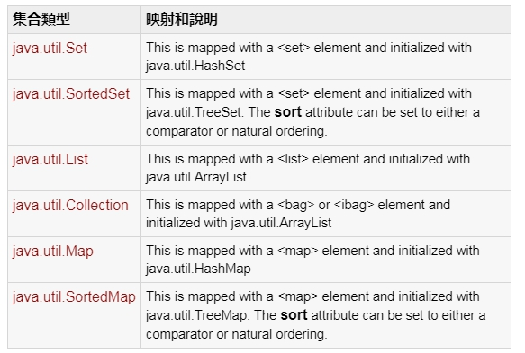
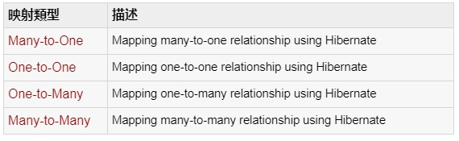
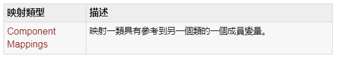

## 十一、Hibenate O/R 映射
### 1. 集合映射（Collection mappings）
#### 如果一個實例或者類中有特定變量的值的集合，那麽我們可以應用 Java 中的任何的可用的接口來映射這些值
### 

### 2. 關聯映射
#### 實體類之間的關聯映射以及表之間的關系是 ORM 的靈魂之處。對象間的關系的子集可以用下列四種方式解釋。關聯映射可以是單向的也可以是雙向的。
### 

### 3. 組件映射
#### 作為變量的一員實體類很可能和其它類具有相關關系。如果引用的類沒有自己的生命周期並且完全依靠於擁有它的那個實體類的生命周期的話，那麽這個引用類因此就可以叫做組件類。
### 