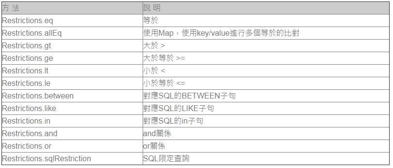
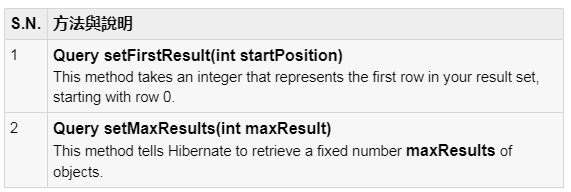

## 十四、Hibernate查詢條件
#### 使用Hibernate時，即使您不了解SQL的使用與撰寫，也可以使用它所提供的API來進行SQL語句查詢， org.hibernate.Criteria對SQL進行封裝，您可以從Java物件的觀點來組合各種查詢條件，由Hibernate自動為您產生 SQL語句，而不用特別管理SQL與資料庫相依的問題，就某個程度的意涵來看，這就像是在編譯時期也可以得到對SQL語法的檢查與驗證。

#### 以最基本的查詢來說，如果您想要查詢某個物件所對應的資料表中所有的內容，您可以如下進行查詢：
	Criteria criteria = session.createCriteria(User.class);
	List users = criteria.list();
		   
	for(Iterator it = users.iterator(); it.hasNext(); ) {
		User user = (User) it.next();
		System.out.println(user.getId() +
								 " \t " + user.getName() +
							  "/" + user.getAge());   
	}

#### Criteria建立後，若不給予任何的條件，預設是查詢物件所對應表格之所有資料，如果您執行以上的程式片段，並於設定檔中設定了了Hibernate的”show_sql”屬性，則可以在主控下看到以下的SQL語句之產生：
	Hibernate: select this_.id as id0_0_, this_.name as name0_0_, this_.age as age0_0_ from T_USER this_
#### org.hibernate.Criteria實際上是個條件附加的容器，如果想要設定查詢條件，則要使用 org.hibernate.criterion.Restrictions的各種靜態方法傳回 org.hibernate.criterion.Criteria實例
#### 傳回的每個org.hibernate.criterion.Criteria 實例代表著一個條件，您要使用org.hibernate.Criteria的add()方法加入這些條件實例
#### 例如查詢” age”大於20且小於40的資料：
	Criteria criteria = session.createCriteria(User.class);
	criteria.add(Restrictions.gt("age", new Integer(20)));
	criteria.add(Restrictions.lt("age", new Integer(40)));
	List users = criteria.list();
		   
	for(Iterator it = users.iterator(); it.hasNext(); ) {
		User user = (User) it.next();
		System.out.println(user.getId() +
								  " \t " + user.getName() +
								 "/" + user.getAge());   
	}
#### Restrictions的gt()方法表示大於（great than）的條件，而lt表示小於（less than）的條件，執行以上程式片段，觀察所產生的SQL語句，將使用where與and子句產來完成SQL的條件查詢：
	Hibernate: select this_.id as id0_0_, this_.name as name0_0_, this_.age as age0_0_ from T_USER this_ where this_.age>? and this_.age<?

#### 使用add()方法加入條件時，預設是使用and來組合條件，如果要用or的方式來組合條件，則可以使用Restrictions.or()方法
#### 例如結合age等於（eq）20或（or）age為空（isNull）的條件：
	Criteria criteria = session.createCriteria(User.class);
	criteria.add(Restrictions.or(
					   Restrictions.eq("age", new Integer(20)),
					   Restrictions.isNull("age")
				   ));
	List users = criteria.list();
#### 觀察所產生的SQL語句，將使用where與or子句完成SQL的條件查詢：

	Hibernate: select this_.id as id0_0_, this_.name as name0_0_, this_.age as age0_0_ from T_USER this_ where (this_.age=? or this_.age is null)

#### 您也可以使用Restrictions.like()方法來進行SQL中like子句的功能，例如查詢”name”中名稱為”just”開頭的資料：
	Criteria criteria = session.createCriteria(User.class);
	criteria.add(Restrictions.like("name", "just%"));
	List users = criteria.list();

#### 觀察所產生的SQL語句如下：

	Hibernate: select this_.id as id0_0_, this_.name as name0_0_, this_.age as age0_0_ from T_USER this_ where this_.name like ?

### Restrictions的幾個常用限定查詢方法如下表所示：

#### ### 使用查詢分頁
#### 有用於分頁查詢接口的兩個方法。

#### This method tells Hibernate to retrieve a fixed number maxResults of objects.
#### 采用上述兩種方法一起，可以在網站或Swing應用程序構建一個分頁組件。下麵是例子，可以擴展來獲取10行：
	Criteria cr = session.createCriteria(Employee.class);
	cr.setFirstResult(1);
	cr.setMaxResults(10);
	List results = cr.list();

#### 排序的結果：
#### org.hibernate.criterion.Order類排序按升序或降序排列你的結果集
#### 這個例子演示了如何使用Order類的結果集進行排序：
	Criteria cr = session.createCriteria(Employee.class);
	// To get records having salary more than 2000
	cr.add(Restrictions.gt("salary", 2000));

	// To sort records in descening order
	crit.addOrder(Order.desc("salary"));

	// To sort records in ascending order
	crit.addOrder(Order.asc("salary"));

	List results = cr.list();

#### Projections:
#### org.hibernate.criterion.Projections類可用於獲取平均值，最大值或最小值的屬性值
#### 以下是涉及不同的方案的一些例子
	Criteria cr = session.createCriteria(Employee.class);

	// To get total row count.
	cr.setProjection(Projections.rowCount());

	// To get average of a property.
	cr.setProjection(Projections.avg("salary"));

	// To get distinct count of a property.
	cr.setProjection(Projections.countDistinct("firstName"));

	// To get maximum of a property.
	cr.setProjection(Projections.max("salary"));

	// To get minimum of a property.
	cr.setProjection(Projections.min("salary"));

	// To get sum of a property.
	cr.setProjection(Projections.sum("salary"));